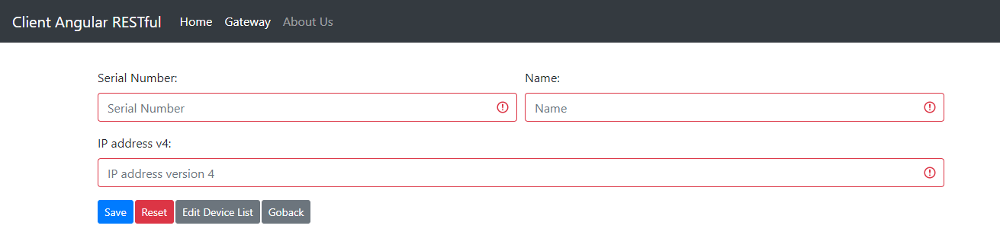

# Client REST Angular  
It is a client RESTful services writed on Angular, require a server RESTful services running.

# run steps: Client REST Angular
- git clone https://github.com/ameksike/cep.muslan.gateway.git
- cd cep.muslan.gateway/client.angular/
- npm install
- npm start

# config 
- client-angular/src/data/config.json => config por read server restful services 
- {
    "port": 3000,
    "host": "localhost",
    "protocol": "http"
}

# develops steps
- npm install -g @angular/cli
- ng new cep.muslan.gateway/client.angular/
- cd cep.muslan.gateway/client.angular/

- npm install ngx-bootstrap bootstrap jquery --save

- ng generate component About
- ng generate component P404
- ng generate component Home
- ng generate component home/component/
- ng generate service home/component/message/message
- ng generate class home/component/message/MessageModel

- ng generate module gateway/gateway --module app --flat --routing
- ng generate component gateway/list
- ng generate component gateway/edit
- ng generate component gateway/details
- ng generate service gateway/services/gateway
- ng generate class gateway/model/GatewayModel

- ng generate module peripheral/peripheral --module app --flat --routing
- ng generate component peripheral/list
- ng generate component peripheral/edit
- ng generate component peripheral/details
- ng generate service peripheral/services/peripheral
- ng generate class peripheral/model/PeripheralModel

